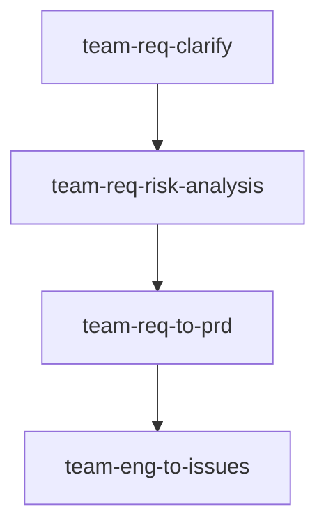

# Skills For Real Teams

团队协作使用的大语言模型技能库，覆盖需求、产品和工程协作流程。

## Quickstart

安装全部技能：

```bash
npx skills@latest add coolbeevip/team-ai-skills --all
```

## Workflow

这些技能可以串联使用。下游技能会读取上游技能的输出物：



每个 `SKILL.md` 都声明了 `输入物` 和 `输出物`，用于说明它会读取哪些上游产物，以及会为哪些下游技能提供材料。

## Workspace

技能默认在项目根目录的 `team-spec/` 下协作：

```text
team-spec/
├── requirements/
│   ├── CONTEXT.md
│   ├── decisions/
│   ├── prd/
│   └── risks/
└── engineering/
    └── issues/
```

`team-eng-to-issues` 默认从 `team-spec/requirements/` 读取需求上下文、PRD 和风险报告，再将工程 issue 草稿写入 `team-spec/engineering/issues/`。
