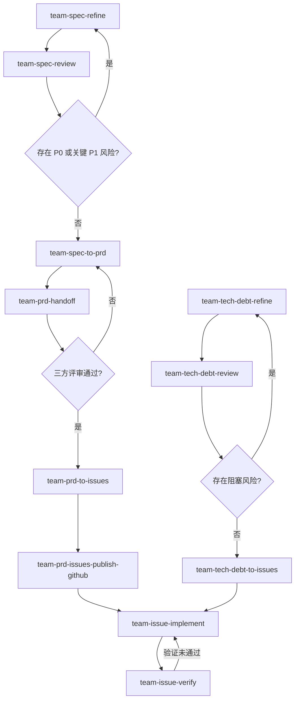

# Skills For Real Teams

团队协作使用的大语言模型技能库，覆盖需求、产品和工程协作流程。

## Quickstart

安装全部技能：

```bash
npx skills@latest add coolbeevip/team-ai-skills --all
```

## Workflow

这些技能可以串联使用。下游技能会读取上游技能的输出物：



`team-spec-refine` 和 `team-spec-review` 可以反复迭代。只有当 P0 和关键 P1 风险被解决或明确接受后，才进入 `team-spec-to-prd` 固化 PRD。

`team-spec/prd/` 中的 PRD 是需求到工程的正式交接边界。`team-prd-handoff` 将 AI 结构化 PRD 转换为人类可评审的交接文档，产品、研发、项目管理三方签字确认后，方可执行 `team-prd-to-issues`。

`team-prd-to-issues` 应以 PRD 为主输入；`CONTEXT.md`、`decisions/` 和 `reviews/` 只能作为背景参考，不能绕过 PRD 直接拆工程任务。

`team-prd-issues-publish-github` 用于把 `team-spec/issues/{slug}/` 下的本地 issue 草稿按依赖顺序批量发布到 GitHub Issues，并回写发布结果。该技能仅处理 GitHub，GitLab 建议使用独立技能。

技术债链路使用 `team-tech-debt-refine -> team-tech-debt-review -> team-tech-debt-to-issues`，并统一收敛到 `team-spec/issues/{slug}/`。技术债链路的 slug 必须包含 `debt`，建议格式 `{yyyy-mm-dd}-debt-{short-english-slug}`，以便后续复用工程实现与验证流程。

每个 `SKILL.md` 都声明了 `输入物` 和 `输出物`，用于说明它会读取哪些上游产物，以及会为哪些下游技能提供材料。

每个需求使用一个唯一 slug 串联全流程，格式为 `{yyyy-mm-dd}-{short-english-slug}`，例如 `2026-05-10-export-filter`。
技术债需求也使用唯一 slug，但必须包含 `debt`，例如 `2026-05-12-debt-cache-cleanup`。

## Workspace

技能默认在目标项目根目录的 `team-spec/` 下协作。`team-spec/` 是运行时工作空间，不属于本技能库的固定内容；它会在安装技能后的业务项目中按需创建。

```text
team-spec/
├── spec/
│   ├── CONTEXT.md
│   ├── decisions/
│   ├── refine/
│   └── reviews/
├── prd/
└── issues/
```

单个需求的产物链路：

```text
team-spec/spec/refine/{slug}.md
team-spec/spec/reviews/{slug}.md
team-spec/prd/{slug}.md
team-spec/prd/{slug}-handoff.md
team-spec/issues/{slug}/
```

`CONTEXT.md` 和 `decisions/` 是长期共享上下文，不替代单次需求的 `refine/{slug}.md`。

`team-prd-to-issues` 默认以 `team-spec/prd/{slug}.md` 为主输入，并参考规格上下文、产品决策和评审报告，再将工程 issue 草稿写入 `team-spec/issues/{slug}/`。

`team-prd-issues-publish-github` 默认读取 `team-spec/issues/{slug}/` 中的本地 issue 草稿，执行依赖排序、dry-run 预览、幂等检查与批量发布，并回写远端 issue 编号、URL 和状态。

`team-issue-implement` 默认以 `team-spec/issues/{slug}/` 中的单个 issue 为主输入，通过行为测试和 red-green-refactor 循环完成实现。

`team-issue-verify` 独立检查实现是否满足 issue、PRD 和风险约束，并输出是否 `ready for PR`。
