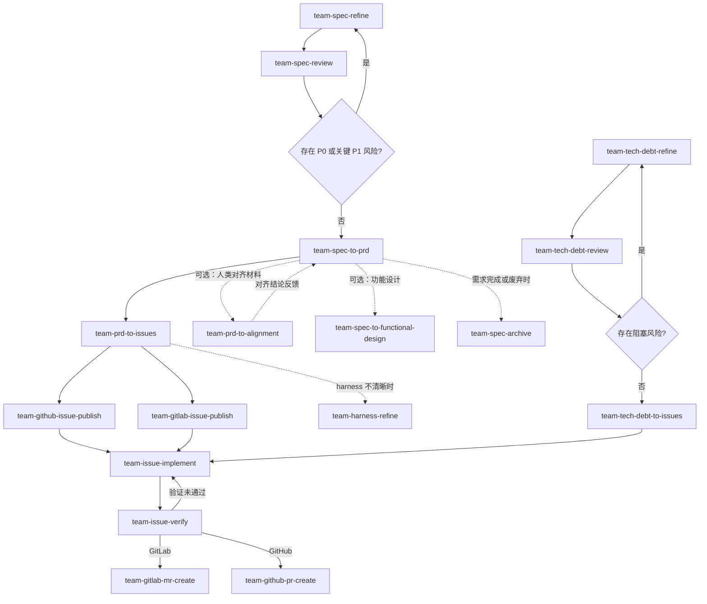

# Skills For Real Teams

团队协作使用的大语言模型技能库，按产品、架构、Agent Harness、交付、技术债和文档职责域组织，覆盖需求到工程交付的协作流程。

## 快速开始

安装全部技能：

```bash
npx skills@latest add coolbeevip/team-ai-skills --all
```

## 技能职责域

本技能库将团队协作拆成六个职责域：产品定义、架构设计、Agent Harness、交付执行、技术债治理和文档质量。每个职责域都可以独立使用，也可以沿着需求到交付的流程串联起来，帮助团队把想法稳定成可评审、可拆解、可实现、可验证的工作。

### 产品定义

产品定义域用于把模糊需求变成团队可以共同理解和评审的产品规格，适合产品经理、业务负责人和需求分析人员在 PRD 形成前使用。

- `team-spec-refine`：通过连续澄清术语、边界、业务规则和验收口径，把初始想法整理成可评审的需求规格。
- `team-spec-review`：从产品、数据、合规、运营、交付和协作角度检查规格风险，并给出是否已准备好进入下一阶段的结论。
- `team-spec-to-prd`：将已经细化并通过评审的规格固化为结构化 PRD，作为需求进入交付阶段的正式输入。
- `team-spec-archive`：把已完成、废弃或暂停的 active 需求产物归档，避免新需求误改旧规格。

### 架构设计

架构设计域用于把已确认的需求与当前代码、接口、数据和系统约束对齐，适合架构师、技术负责人或文档工程师在方案评审前使用。

- `team-spec-to-functional-design`：基于需求规格、PRD 和源代码生成企业级功能设计说明书，帮助团队形成可评审的实现方案。

### Agent Harness

Agent Harness 域用于让真实项目更适合 AI agent 长期工作，适合团队在接入 agent、开发流程变化、测试命令变化、失败案例沉淀或技术债治理前后反复使用。

- `team-harness-refine`：通过真实代码、开发任务和失败反馈持续细化 `AGENTS.md` / `CLAUDE.md`、`docs/agent-harness/`、验证命令、反馈循环和 harness debt。

### 交付执行

交付执行域用于把 PRD 拆成可领取的 issue，并把实现结果验证到可提交 PR 的状态，适合研发负责人、工程师、测试人员和工程 agent 使用。

- `team-prd-to-issues`：把 PRD 拆解成可独立领取、可验证、按依赖排序的工程 issue。
- `team-github-issue-publish`：将本地 issue 草稿发布到 GitHub Issues，支持整目录批量发布或指定单个 issue，并回写远端编号、URL 和发布状态。
- `team-gitlab-issue-publish`：将本地 issue 草稿发布到 GitLab Issues，支持整目录批量发布或指定单个 issue，并回写远端 IID/ID、URL 和发布状态。
- `team-issue-implement`：围绕单个 issue 采用行为测试和 TDD 循环完成代码与测试变更，完成后自动衔接 `team-issue-verify`。
- `team-issue-verify`：独立检查实现是否满足 issue、PRD 和风险约束，并给出是否可提交 PR 的结论。
- `team-gitlab-mr-create`：推送已完成的 issue 分支，并创建标题和正文都关联 issue 编号的 GitLab Merge Request。
- `team-github-pr-create`：推送已完成的 issue 分支，并创建标题和正文都关联 issue 编号的 GitHub Pull Request。

### 技术债治理

技术债治理域用于把“代码需要重构”“系统不稳定”“维护成本太高”这类模糊诉求变成有证据、有优先级、有验收标准的工程工作，适合技术负责人、平台团队和稳定性负责人使用。

- `team-tech-debt-refine`：将技术债诉求细化为包含证据、影响范围、风险等级和验收口径的技术债规格。
- `team-tech-debt-review`：评审技术债规格的风险、优先级、阻塞项和可执行性，判断是否可以进入工程拆解。
- `team-tech-debt-to-issues`：把已评审的技术债规格拆解为可独立领取、可验证、按依赖排序的工程 issue。

### 文档质量

文档质量域用于保证团队产物在云文档、评审材料和导出场景中保持结构清晰、样式稳定，适合文档维护者、项目管理人员和需要发布正式材料的团队使用。

- `team-prd-to-alignment`：将 AI 结构化 PRD 转换为适合需求、研发和项目管理进行人类评审与共识对齐的演示文稿式材料。
- `team-md-style-check`：检查 Markdown 文档是否符合飞书文档导入后的样式映射规则，并给出可直接修改的格式建议。

## 工作流

这些技能可以串联使用。下游技能会读取上游技能的输出物：



`team-spec-refine` 和 `team-spec-review` 可以反复迭代。只有当 P0 和关键 P1 风险被解决或明确接受后，才进入 `team-spec-to-prd` 固化 PRD。

`team-spec/active/prd/` 中的 PRD 是需求到工程的正式交接边界。`team-prd-to-alignment` 可将 AI 结构化 PRD 转换为适合需求、研发和项目管理讨论的人类对齐材料；`team-prd-to-issues` 仍应以 PRD 为主输入。

`team-spec-to-functional-design` 基于 PRD 与源代码生成企业级功能设计说明书，供架构师和技术负责人在实现前评审，不影响 PRD 的权威地位。

`team-prd-to-issues` 应以 PRD 为主输入；`CONTEXT.md`、`decisions/` 和 `reviews/` 只能作为背景参考，不能绕过 PRD 直接拆工程任务。拆解过程中如果发现验证命令、项目入口或 agent 工作环境不清晰，可使用 `team-harness-refine` 补全。

`team-github-issue-publish` 用于把 `team-spec/active/issues/{slug}/` 下的本地 issue 草稿发布到 GitHub Issues，并回写发布结果。默认按依赖顺序批量发布，也可通过 `--issue` 指定单个 issue。该技能仅处理 GitHub。

`team-gitlab-issue-publish` 用于把 `team-spec/active/issues/{slug}/` 下的本地 issue 草稿发布到 GitLab Issues，并回写发布结果。默认按依赖顺序批量发布，也可通过 `--issue` 指定单个 issue。该技能仅处理 GitLab。

`team-spec-archive` 用于把 `team-spec/active/` 中已完成、废弃或暂停的需求产物归档到 `team-spec/archive/{slug}/`，清空活跃工作区以避免下一个需求误改旧规格。开始新需求前，若 active 中已有其他 slug，应先归档。

技术债链路使用 `team-tech-debt-refine -> team-tech-debt-review -> team-tech-debt-to-issues`，并统一收敛到 `team-spec/active/issues/{slug}/`。技术债链路的 slug 必须包含 `debt`，建议格式 `{yyyy-mm-dd}-debt-{short-english-slug}`，以便后续复用工程实现与验证流程。

每个 `SKILL.md` 都声明了 `输入物` 和 `输出物`，用于说明它会读取哪些上游产物，以及会为哪些下游技能提供材料。

每个 `SKILL.md` 还包含 `triggers` 字段，列出用户触发该技能时常用的自然语言短语（中英双语）。AI 可通过匹配用户输入与 `triggers` 自动推荐合适的技能，无需用户预先知道技能名称。

每个需求使用一个唯一 slug 串联全流程，格式为 `{yyyy-mm-dd}-{short-english-slug}`，例如 `2026-05-10-export-filter`。
技术债需求也使用唯一 slug，但必须包含 `debt`，例如 `2026-05-12-debt-cache-cleanup`。

## 工作空间

技能默认在目标项目根目录的 `team-spec/` 下协作。`team-spec/` 是运行时工作空间，不属于本技能库的固定内容；它会在安装技能后的业务项目中按需创建。

```text
team-spec/
├── active/
│   ├── spec/
│   │   ├── CONTEXT.md
│   │   ├── decisions/
│   │   ├── refine/
│   │   └── reviews/
│   ├── prd/
│   ├── issues/
│   └── design/
└── archive/
    └── {slug}/
        ├── spec/
        ├── prd/
        ├── issues/
        ├── design/
        └── ARCHIVE.md
```

单个需求的产物链路：

```text
team-spec/active/spec/refine/{slug}.md
team-spec/active/spec/reviews/{slug}.md
team-spec/active/prd/{slug}.md
team-spec/active/prd/{slug}-alignment.md
team-spec/active/issues/{slug}/
```

`CONTEXT.md` 和 `decisions/` 是长期共享上下文，不替代单次需求的 `refine/{slug}.md`。

`team-spec/active/` 只应保留当前活跃需求。开始新需求前，如果 active 中已有其他 slug，应先使用 `team-spec-archive` 归档到 `team-spec/archive/{slug}/`，或明确继续旧需求。`team-spec/archive/` 默认只读，除非用户显式指定历史 slug 或文件路径。

`team-prd-to-issues` 默认以 `team-spec/active/prd/{slug}.md` 为主输入，并参考规格上下文、产品决策和评审报告，再将工程 issue 草稿写入 `team-spec/active/issues/{slug}/`。

`team-github-issue-publish` 默认读取 `team-spec/active/issues/{slug}/` 中的本地 issue 草稿，执行依赖排序、试运行预览、幂等检查与批量发布；如果通过 `--issue` 指定单个 issue，则只处理该草稿，并回写远端 issue 编号、URL 和状态。

`team-gitlab-issue-publish` 默认读取 `team-spec/active/issues/{slug}/` 中的本地 issue 草稿，执行依赖排序、试运行预览、幂等检查与批量发布；如果通过 `--issue` 指定单个 issue，则只处理该草稿，并回写远端 issue IID/ID、URL 和状态。

`team-issue-implement` 默认以 `team-spec/active/issues/{slug}/` 中的单个 issue 为主输入，通过行为测试和 red-green-refactor 循环完成实现，并在实现结束后自动衔接 `team-issue-verify`。

`team-issue-verify` 独立检查实现是否满足 issue、PRD 和风险约束，并输出是否可提交 PR。

`team-gitlab-mr-create` 默认从当前分支推断 issue 编号，推送分支，并创建包含 `Closes #{issue}` 的 GitLab Merge Request。该技能仅处理 GitLab MR；GitHub PR 应使用独立技能。

`team-github-pr-create` 默认从当前分支推断 issue 编号，推送分支，并创建包含 `Closes #{issue}` 的 GitHub Pull Request。该技能仅处理 GitHub PR；GitLab MR 应使用独立技能。
