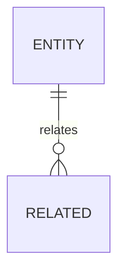

# 数据模型说明

## 执行摘要
- [TODO] 汇总数据模型来源、核心实体、字段关系、数据库/schema 证据和未知项。

## 文档元信息
| 字段 | 内容 |
| --- | --- |
| 用途 | 数据模型接手文档 |
| 读者 | 接手项目的研发人员和 AI |
| 生成日期 | [TODO] |
| 置信度 | [TODO] |
| 扫描范围 | [TODO] |
| 是否包含推断 | [TODO] |
| 声明意图来源 | [TODO] |
| 源码现实来源 | [TODO] |

## 数据关系图

## 核心实体
| 实体/表/模型 | 来源 | 关键字段 | 关系 | 置信度 |
| --- | --- | --- | --- | --- |
| [TODO] | [TODO] | [TODO] | [TODO] | [TODO] |

## 来源文件
| 路径 | 关键符号/对象 | 用途 | 备注 |
| --- | --- | --- | --- |
| [TODO] | [TODO] | [TODO] | [TODO] |

## TODO / 未知项
- [TODO]

## 需要用户确认
- [ASK USER]
