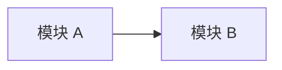

# 依赖关系

## 执行摘要
- [TODO] 汇总模块依赖、第三方库、外部服务依赖、循环依赖和高风险边界。

## 文档元信息
| 字段 | 内容 |
| --- | --- |
| 用途 | 依赖关系接手文档 |
| 读者 | 接手项目的研发人员和 AI |
| 生成日期 | [TODO] |
| 置信度 | [TODO] |
| 扫描范围 | [TODO] |
| 是否包含推断 | 是 / 否 |
| 声明意图来源 | [TODO] |
| 源码现实来源 | [TODO] |

## 依赖图

## 依赖表
| 上游 | 下游 | 类型 | 来源 | 风险 |
| --- | --- | --- | --- | --- |
| [TODO] | [TODO] | [TODO] | [TODO] | [TODO] |

## 来源文件
| 路径 | 关键符号/对象 | 用途 | 备注 |
| --- | --- | --- | --- |
| [TODO] | [TODO] | [TODO] | [TODO] |

## TODO / 未知项
- [TODO]

## 需要用户确认
- [ASK USER]
