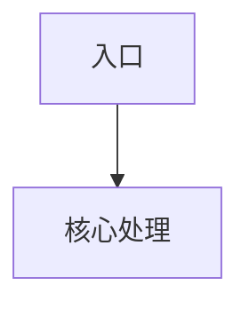

# Fxxx [功能名称]详细设计

## 执行摘要
- [TODO] 概述功能的入口、核心流程、数据模型、外部依赖、测试方式和主要风险。

## 文档元信息
| 字段 | 内容 |
| --- | --- |
| 用途 | 单功能详细设计 |
| 读者 | 接手项目的研发人员和 AI |
| 生成日期 | [TODO] |
| 置信度 | [TODO] |
| 扫描范围 | [TODO] |
| 是否包含推断 | [TODO] |
| 声明意图来源 | [TODO] |
| 源码现实来源 | [TODO] |

## 1 功能概述
[TODO]

## 2 使用入口
| 入口 | 路径 | 符号/对象 | 说明 |
| --- | --- | --- | --- |
| [TODO] | [TODO] | [TODO] | [TODO] |

## 3 代码结构
[TODO]

## 4 核心流程

## 5 数据模型
[TODO]

## 6 接口与外部依赖
[TODO]

## 7 状态与异常处理
[TODO]

## 8 权限与安全约束
[TODO]

## 9 测试与验证方式
[TODO]

## 10 扩展点与修改建议
[TODO]

## 11 未确认事项
- [TODO]

## 来源文件
| 路径 | 关键符号/对象 | 用途 | 备注 |
| --- | --- | --- | --- |
| [TODO] | [TODO] | [TODO] | [TODO] |

## 需要用户确认
- [ASK USER]
