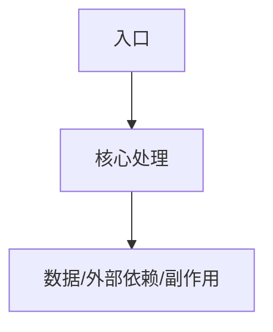

# 代码库专题深挖：[主题]

## 执行摘要
- [TODO] 用 5~12 行说明专题范围、实现链路、关键证据、风险和待确认事项。

## 专题元信息
| 字段 | 内容 |
| --- | --- |
| 日期 | [TODO] |
| slug | [TODO] |
| 用户问题 | [TODO] |
| 专题类型 | 追踪型 / 修改型 / 调试型 / 风险型 |
| 主动提问 | [TODO] |
| 用户反馈 | [TODO] |
| 选中 Feature | Fxxx [TODO] |
| 走读层级 | L0 设计灵魂与场景 / L2 入口调用链 / L3 数据配置接口 / L4 测试验证 / L5 修改影响面 |
| 关联 onboarding 路径 | [TODO] |
| 源码范围 | [TODO] |
| 置信度 | 高 / 中 / 低 |

## 问题拆解
| 子问题 | 结论 | 证据 |
| --- | --- | --- |
| [TODO] | [TODO] | [TODO] |

## Feature 上下文
| Feature | 功能域 | 入口 | 主要源码 | 置信度 |
| --- | --- | --- | --- | --- |
| Fxxx [TODO] | [TODO] | [TODO] | [TODO] | [TODO] |

## 设计灵魂与场景
| 项目 | 内容 | 证据 |
| --- | --- | --- |
| 设计灵魂 | [TODO] 这个 feature 为什么存在，在系统中承担什么角色 | [TODO] |
| 触发场景 | [TODO] 用户场景 / 业务流程 / 系统事件 / 接口调用 / 后台任务 | [TODO] |
| 服务对象 | [TODO] 用户、调用方、上游模块、下游模块或外部系统 | [TODO] |
| 问题边界 | [TODO] 解决什么，不解决什么 | [TODO] |
| 成功信号 | [TODO] 什么现象说明它正常工作 | [TODO] |
| 异常场景 | [TODO] 什么情况暴露风险或边界 | [TODO] |

## 实现链路

## 关键源码说明
| 顺序 | 路径 | 符号/对象 | 作用 | 注意事项 |
| --- | --- | --- | --- | --- |
| 1 | [TODO] | [TODO] | [TODO] | [TODO] |

## 数据、配置、接口和测试证据
| 类别 | 路径 | 说明 | 置信度 |
| --- | --- | --- | --- |
| 数据 / 配置 / 接口 / 测试 | [TODO] | [TODO] | [TODO] |

## 修改或验证建议
- [TODO] 若用户目标是修改或调试，说明建议入口、联动文件和验证命令。

## 下一轮可选问题
- [TODO] 继续追踪下游依赖。
- [TODO] 继续看数据/配置/接口。
- [TODO] 继续看测试验证。
- [TODO] 切换到相关 feature。

## 风险和影响面
| 风险 | 影响范围 | 证据 | 建议 |
| --- | --- | --- | --- |
| [TODO] | [TODO] | [TODO] | [TODO] |

## 来源文件
| 路径 | 符号/对象 | 用途 | 证据类型 |
| --- | --- | --- | --- |
| [TODO] | [TODO] | [TODO] | onboarding 文档结论 / 源码显式证据 / 测试配置证据 / 代码推断 |

## TODO / 未知项
- [TODO]

## 需要用户确认
- [ASK USER]
