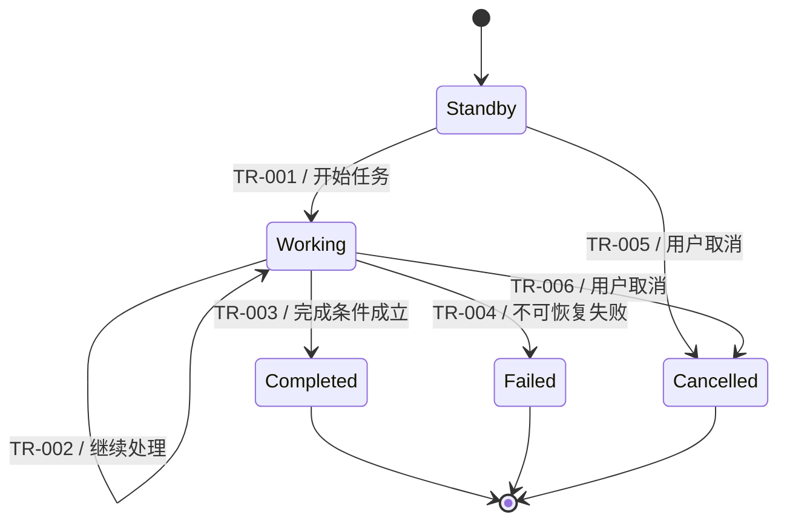

# Use Case、故事板与状态机格式

当机器人包含多个业务目标、参与者、触发方式，或需要非平凡的异常、并发和停止逻辑时，使用此格式扩展 `team-spec/active/{slug}/spec/discovery.md`。简单场景按需裁剪，不为完整形式重复已有事实。

## 目录

1. 业务背景
2. Use Case 清单
3. 单个 Use Case 合同
4. 行为骨架、故事板与可观察 SOP
5. 状态机清单
6. 状态转换
7. 完成与停止合同
8. 行为验证

## 1. 业务背景

- 当前情境与问题：
- 现行处理方式：
- 核心痛点与受影响角色：
- 为什么适合机器人，以及不自动化什么：

把用户叙事压缩为可验证事实、假设和业务动机；不要保留与决策无关的长故事。

## 2. Use Case 清单

| UC ID | 名称 | 业务目标 | 主要/次要 Actor | 触发 | 优先级 | MVP | 与其他 UC 的关系 |
| --- | --- | --- | --- | --- | --- | --- | --- |

关系使用包含、依赖、互斥、可并发或可抢占描述。机器人是待设计系统；Actor 是发起、协作、受影响、异常处理或负责的人员与外部系统。

## 3. 单个 Use Case 合同

### UC-{编号} {名称}

| 字段 | 内容 |
| --- | --- |
| 业务目标与价值 |  |
| 主要 Actor |  |
| 次要 Actor 与外部系统 |  |
| 触发事件 |  |
| 前置条件 |  |
| 正向对象与目标状态 |  |
| 负向对象与明确不做 |  |
| 主成功路径 |  |
| 替代路径 |  |
| 异常与人工介入 |  |
| 成功后置条件与证据 |  |
| 正常取消与超时 |  |
| 安全停止与意外中断 |  |
| 频率、优先级与业务基线 |  |
| 待验证假设 |  |

当对象判定存在多种可能定义时，保留候选规则及其能力影响：

| 候选规则 | 示例 | 导出的能力 | 误判风险 | 选择状态 |
| --- | --- | --- | --- | --- |
| 语义类别 | 玩具/非玩具 | 分类、检测 | 未见类别、相似物 | 待确认 |
| 场景变化 | 新出现或移位物品 | 基线建模、变化检测 | 日常变化被误处理 | 待确认 |
| 对象清单 | 已登记对象 | 实例识别、主数据 | 清单维护成本 | 待确认 |

## 4. 行为骨架、故事板与可观察 SOP

先根据 Use Case 建立状态机骨架，再用故事板展开高风险或含糊状态：

| 骨架状态 | 进入事件/Guard | 用户可观察目标 | 正常退出 | 失败/取消/人工介入 | 待故事板展开项 |
| --- | --- | --- | --- | --- | --- |

骨架只保留开始、主要任务阶段、正常完成、失败、取消和人工介入，不提前设计尚无场景证据的内部状态。

| 帧 ID | UC/状态 | 视角 | Actor 与环境 | 机器人可获得的信息 | 可观察动作 | 空间/时间条件 | 输出状态与成功证据 | 分支 | 新发现 ID |
| --- | --- | --- | --- | --- | --- | --- | --- | --- | --- |

按一次真实任务从触发到完成回放。视角使用用户、机器人传感器、俯视规划、操作近景或环境状态等明确描述；不得把人从俯视图知道的信息误写成机器人已经感知的信息。图片、现场照片标注、简图或文字帧均可，不要求为了形式生成精美图片。

为帧使用稳定编号，例如 `SB-UC01-01`。只有当一帧包含多个重要动作、成功证据不明确、高风险失败、多个子系统协作、关键选型影响或抽象词时，才建立 `SB-UC01-06.1`、`SB-UC01-06.2` 等子帧。当输入、输出、成功、失败和可推导能力明确时停止；跳过不产生新认知的简单帧。

逐帧检查：

- 机器人从哪里获得必要信息，信息在哪个坐标系，是否包含不确定度？
- 画面呈现的真实环境信息与机器人可获得的信息有什么差距？
- 对象、机器人、障碍物和目标位置之间有什么空间或时间关系？
- 本帧需要做什么选择，规则来自需求、方案假设还是任意示例？
- 输入和输出环境状态是什么，下一步成立需要什么条件？
- 如何验证成功；失败后回到已有状态、进入新状态还是请求人工介入？
- 本帧产生了哪些需求、能力、指标、决策、假设、风险和 PoC？

画面中用框或圆圈标记对象只表示需要定位目标，不自动推出实例分割；图像坐标也不自动等于可导航或可抓取的世界位姿。把语音、USB 相机、机器学习、最近目标等实现写成候选方案或假设，留到后续比较和验证。

### 故事板发现台账

| 发现 ID | 来源帧 | 类型 | 发现内容 | 对范围/方案的影响 | 状态与依据 | 后续去向 |
| --- | --- | --- | --- | --- | --- | --- |
| CAP-001 | SB-UC01-02 | CAP | 区分目标和非目标 | 影响感知能力 | 待推导 | Software Specification |
| DEC-001 | SB-UC01-03 | DEC | 选择最近或最易操作目标 | 影响调度策略 | 待用户确认 | 访谈问题 |

类型使用 `REQ`、`CAP`、`METRIC`、`DEC`、`HYP`、`RISK` 或 `POC`。每项发现必须进入访谈问题、需求、工程指标、技术决策、风险、PoC 或验收之一；不得只停留在故事板中。

完成故事板后回到状态机骨架，补齐或修正状态、事件、Guard、超时、重试、并发、抢占和安全监督。状态机与故事板不一致时，以已经确认的场景事实为依据共同修订，不能只更新其中一份。

## 5. 状态机清单

| 状态机 ID | 层级 | 负责范围 | 上级/并行状态机 | 不负责什么 |
| --- | --- | --- | --- | --- |
| SM-MISSION | 任务 | 端到端任务目标 |  | 具体避障和抓取控制 |
| SM-MOBILITY | 移动 | 规划、行驶、避障和阻塞恢复 | SM-MISSION | 任务完成判定 |
| SM-MANIPULATION | 操作 | 接近、抓取、放置和验证 | SM-MISSION | 全局导航 |
| SM-INTERACTION | 交互 | 命令、会话、确认和告警 | 并行 | 安全控制 |
| SM-SAFETY | 安全监督 | 急停、保护停和危险监控 | 全局并行 | 业务任务决策 |

只保留当前场景需要的层级。避障、健康监控等横跨多个任务状态的能力放入并行监督状态机，不复制到每个业务状态。

## 6. 状态转换

每个任务状态机必须同时提供 Mermaid `stateDiagram-v2` 图和状态转换表。任务级 `SM-MISSION` 始终提供图；移动、操作、交互或安全监督状态机一旦进入设计范围，也分别提供图，不把全部层级挤进一个巨型图。

### 6.1 状态机图

图中使用稳定、简短的状态名；每条边标注转换 ID 和事件，必要时补充短 Guard。复杂 Guard、动作、超时、重试、证据和错误处理留在表格。用复合状态或多个图表达分层状态机；用注释说明全局安全抢占，不绘制难以阅读的全连接线。

### 6.2 状态转换表

| 转换 ID | 状态机 ID | 当前状态 | 事件 | Guard | 动作 | 下一状态 | 超时/重试 | 失败处理 | 成功证据 |
| --- | --- | --- | --- | --- | --- | --- | --- | --- | --- |

### 6.3 图表一致性检查

- 图中的每个状态、正常转换、异常分支、循环、取消和终态都能在表中找到对应记录。
- 表中的每个转换 ID 都在对应图中出现；若为全局安全抢占的折叠表示，必须在图注中列出覆盖范围。
- 图和表使用相同的状态名、状态机 ID 与转换方向，不使用同义词分别命名。
- Guard 冲突、不可达状态、无出口状态和无限重试必须在评审前处理；有意的吸收终态除外。
- 图形负责导航和沟通，表格负责完整语义；发生冲突时依据已确认场景事实同步修订两者，不允许只修一份。

## 7. 完成与停止合同

| 退出类型 | 触发条件 | 所需证据 | 机器人动作 | 恢复或人工动作 |
| --- | --- | --- | --- | --- |
| 正常完成 |  |  |  |  |
| 用户取消 |  |  |  |  |
| 任务超时 |  |  |  |  |
| 保护停止 |  |  |  |  |
| 紧急停止 |  |  |  |  |
| 意外断电/故障 |  |  |  |  |

“一段时间未发现目标”只能作为待验证假设。结合区域覆盖、不可达区域、漏检风险、跳过对象、重复巡检和人工确认定义完成证据。

## 8. 行为验证

| 验证 ID | UC/状态机 ID | 初始状态 | 事件与步骤 | 预期转换或结果 | 样本/次数 | 通过门槛 |
| --- | --- | --- | --- | --- | --- | --- |
